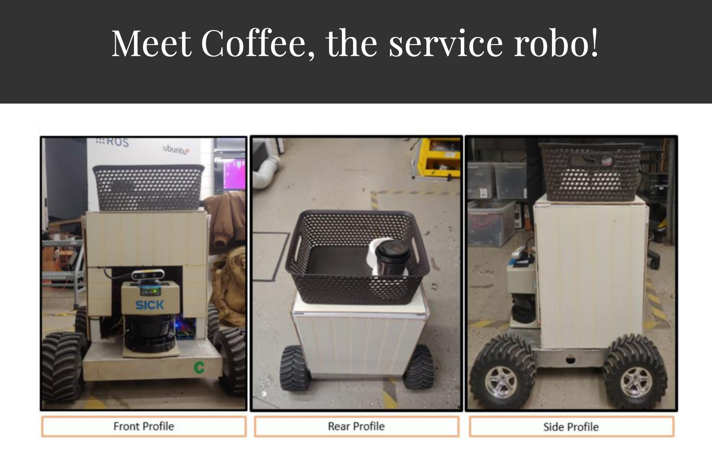

# Coffee: The Service Robo

Coffee is a service robot that I worked on as part of my Master's project. The goal of the project was to build the robot from scratch and integrate the hardware, sensing, mapping, navigation, and control systems into one working platform.

The robot uses LiDAR and RGB-D cameras to understand its surroundings. It can be manually controlled using a joystick, navigate through a room, and create 2D and 3D maps using SLAM.

## Project Overview

During this project, I worked on building and integrating the different parts of the robotic system rather than using an existing robot platform.

Some of the main capabilities of Coffee include:

- Manual directional control using a joystick
- Environment sensing using LiDAR and RGB-D cameras
- 2D mapping using SLAM
- 3D mapping of the surrounding environment
- Navigation through a room
- Image detection using a dataset
- Integration of the robot's electrical and sensing components

The project involved bringing these different components together so that the robot could sense its environment, build a map, and move through the space.

## How It Works

At a high level, Coffee follows this workflow:

1. The sensors collect information about the surrounding environment.
2. LiDAR and RGB-D data are used to understand the robot's position and surroundings.
3. SLAM is used to simultaneously localize the robot and build a map.
4. The robot can generate 2D and 3D representations of the environment.
5. A joystick can be used to control the robot's movement.
6. The vision system can identify images from the provided dataset.

## Hardware

The robot was built from scratch and included multiple sensing and control components.

### Sensors

- LiDAR
- RGB-D camera

### Control

- Joystick for directional control
- Robot drive system

### Other Components

- Electrical and power components
- On-board computing hardware
- Motor and control electronics

## Mapping and SLAM

One of the main parts of the project was implementing SLAM for mapping and navigation.

Coffee can create both 2D and 3D maps while moving through a room. SLAM allows the robot to estimate its position while simultaneously building a representation of the environment.

The project documentation includes examples of the generated maps and the overall workflow.

## Computer Vision

Coffee also includes an image detection component.

The system can detect images stored in a dataset and distinguish between different images. This was developed as part of the robot's perception capabilities.

## My Work

This was a hands-on Master's project where I worked on the robot as a complete system.

My work involved:

- Building the robotic platform from scratch
- Integrating LiDAR and RGB-D sensing
- Working with SLAM for mapping and localization
- Working on 2D and 3D mapping
- Implementing joystick-based robot control
- Integrating the different hardware and electrical components
- Working on the image detection functionality
- Testing the robot while navigating through a room

The main challenge was getting the different hardware and software components to work together as one system.

## Project Documentation

The original project documentation contains additional details about Coffee, including the general workflow, mapping capabilities, image detection, and electrical components.

## Source Code

The original source code is not included in this repository. The project was completed as a Master's project, and I no longer have the complete codebase.

This repository is intended to document the project, its architecture, capabilities, and the work involved in building the robot.

## Project Status

Completed as part of my Master's project.

## Author

**Parisha Joshi**

Master's Project — Robotics / Computer Engineering
